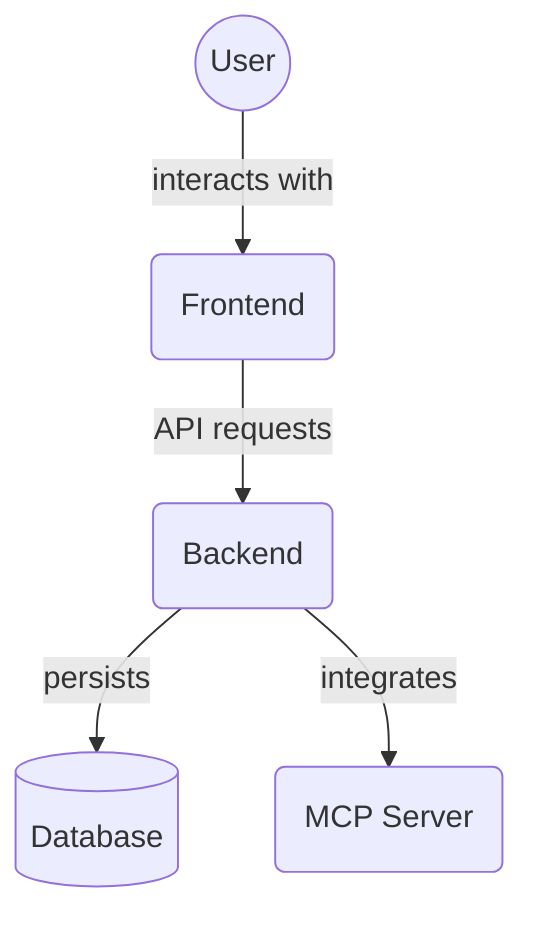

# Frontend Design Tokens (`frontend/src/tokens/`)

This directory contains the definition of design tokens used throughout the frontend application. Design tokens are the visual design atoms of the application, such as colors, typography scales, spacing units, and breakpoints. Defining them centrally ensures design consistency.

Key files:

*   `colors.ts`: Defines the color palette.
*   `fontFamily.ts`: Defines the application's font family stacks.
*   `fontSize.ts`: Defines the font size scale.
*   `typography.ts`: Aggregates typography tokens like font families, sizes, weights, and line heights.
*   `spacing.ts`: Defines the spacing scale (padding, margin, gaps).
*   `sizing.ts`: Defines size values for components and elements.
*   `breakpoints.ts`: Defines screen breakpoints for responsive design.
*   `zIndex.ts`: Defines z-index values for layering.
*   `shadows.ts`: Defines box and text shadows.
*   `transitions.ts`: Defines transition properties and durations.
*   `opacity.ts`: Defines opacity values.
*   `blur.ts`: Defines blur values.
*   `index.ts`: Barrel file re-exporting all tokens.
*   `__tests__/`: Contains unit tests for the design tokens.

## Architecture Diagram

<!-- File List Start -->
## File List

- `blur.ts`
- `breakpoints.ts`
- `colors.ts`
- `fontFamily.ts`
- `fontSize.ts`
- `index.ts`
- `opacity.ts`
- `shadows.ts`
- `sizing.ts`
- `transitions.ts`
- `typography.ts`
- `zIndex.ts`

<!-- File List End -->

