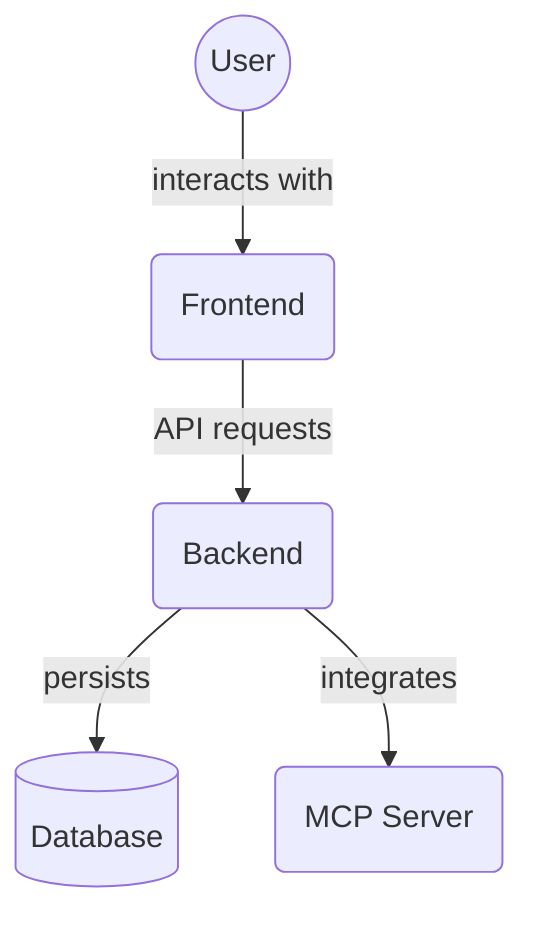

# Frontend TypeScript Types (`frontend/src/types/`)

This directory centralizes all TypeScript type definitions, interfaces, enums, and Zod schemas used throughout the frontend application. This ensures type safety, consistency, and provides a single source of truth for data structures.

## Main Aggregator

### `index.ts`

- **Purpose**: Acts as the primary entry point for all types. It re-exports all definitions from the other type files in this directory (`project.ts`, `agent.ts`, `task.ts`) and defines canonical shared types.
- **Canonical Shared Types Defined Locally**:
  - `SortDirection`: `"asc" | "desc"` (Used by all entity sort options).
  - `TaskSortField`: Union type for all valid task sorting fields (e.g., `"created_at"`, `"title"`).
  - `TaskSortOptions`: Interface `{ field: TaskSortField; direction: SortDirection; }`.
  - `PaginationParams`: Interface `{ page: number; pageSize: number; }`.
- **Common Types Defined Locally**:
  - `ApiResponse<T>`: Generic interface for API responses containing a single data item and an optional error object.
  - `ApiListResponse<T>`: Generic interface for API responses containing a list of items, total count, and pagination details.
  - `ThemeMode`: `'light' | 'dark' | 'system'`.
  - `ToastType`: `'success' | 'error' | 'warning' | 'info'`.
  - `ToastMessage`: Interface `{ id: string; type: ToastType; message: string; duration?: number; }`.
  - `TaskSortField`: (Also defined in `task.ts`) Union type for task sorting fields.
  - `TaskSortOptions`: (Also defined in `task.ts`) Interface for task sort options.
- **Usage**: Components and services should typically import types from this `index.ts` file (e.g., `import { Task, Project } from '@/types';`).

## Entity-Specific Type Files

### `project.ts`

- **Purpose**: Contains all type definitions and Zod schemas related to **Projects**.
- **Key Exports**:
  - `projectSchema` (Zod schema): Base schema for project data validation (`id`, `name`, `description`, `created_at`, `updated_at`, `task_count`, `completed_task_count`, `is_archived`).
  - `Project` (TypeScript type): Inferred from `projectSchema`.
  - `projectCreateSchema`, `ProjectCreateData`: For creating new projects.
  - `projectUpdateSchema`, `ProjectUpdateData`: For updating existing projects.
  - `ProjectWithMeta`: Interface extending `Project` with additional computed fields like `tasks`, `progress`, and `status`.
  - `ProjectFilters`: Interface for project filtering criteria.
  - `ProjectSortOptions`: Interface for project sorting options.
  - `ProjectError`, `ProjectResponse`, `ProjectListResponse`: API-related types for projects.

### `agent.ts`

- **Purpose**: Contains all type definitions and Zod schemas related to **Agents**.
- **Key Exports**:
  - `agentSchema` (Zod schema): Base schema for agent data validation (`id`, `name`, `created_at`, `updated_at`).
  - `Agent` (TypeScript type): Inferred from `agentSchema`.
  - `agentCreateSchema`, `AgentCreateData`: For creating new agents.
  - `agentUpdateSchema`, `AgentUpdateData`: For updating existing agents.
  - `AgentWithMeta`: Interface extending `Agent` with additional computed fields like `tasks`, `taskCount`, and `status`.
  - `AgentFilters`: Interface for agent filtering criteria.
  - `AgentSortOptions`: Interface for agent sorting options.
  - `AgentError`, `AgentResponse`, `AgentListResponse`: API-related types for agents.
  - `AgentCapability`: Interface describing an agent's capability.
  - `AgentRole`: Union type for predefined agent roles (e.g., `'BuilderAgent'`, `'ResearchAgent'`).

### `task.ts`

- **Purpose**: Contains all type definitions, enums, and Zod schemas related to **Tasks**.
- **Key Exports**:
  - `TaskStatus` (Enum): Defines possible task statuses (e.g., `PENDING`, `IN_PROGRESS`).
  - `TaskPriority` (Enum): Defines task priority levels (e.g., `LOW`, `MEDIUM`, `HIGH`).
  - `taskSchema` (Zod schema): Base schema for task data validation (`id`, `title`, `description`, `status`, `project_id`, `agent_id`, `is_archived`, etc.).
  - `Task` (TypeScript type): Inferred from `taskSchema`.
  - `taskCreateSchema`, `TaskCreateData`: For creating new tasks.
  - `taskUpdateSchema`, `TaskUpdateData`: For updating existing tasks.
  - `TaskWithMeta`: Interface extending `Task` with additional computed fields.
  - `TaskFilters`: Interface for task filtering criteria.
  - `TaskSortOptions`: Interface for task sorting options.
  - `TaskError`, `TaskResponse`, `TaskListResponse`: API-related types for tasks.

## Architecture Diagram

<!-- File List Start -->
## File List

- `agent.ts`
- `audit_log.ts`
- `comment.ts`
- `index.ts`
- `mcp.ts`
- `memory.ts`
- `project.ts`
- `project_template.ts`
- `agent_prompt_template.ts`
- `rules.ts`
- `task.ts`
- `user.ts`

<!-- File List End -->

