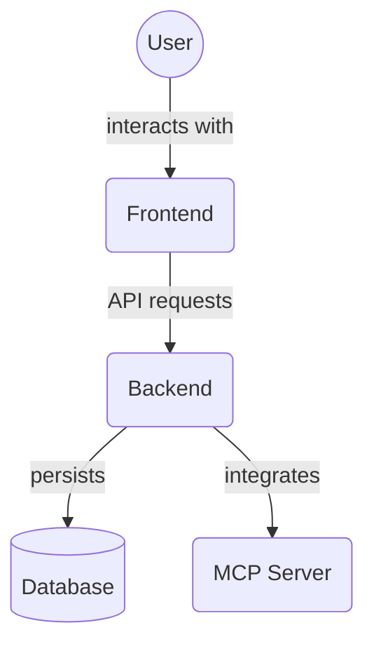

# Utility Functions (`frontend/src/utils/`)

This directory is intended to store general-purpose utility functions that can be used across various parts of the frontend application.

These might include functions for data formatting, validation, calculations, or other helper routines that don't fit neatly into other categories like `lib` (which might be more for core/shared business logic or type-safe utilities) or specific component/module logic.

Currently, this directory is empty. As common, reusable utility functions are identified or developed, they can be placed here.

## Architecture Diagram

<!-- File List Start -->
## File List

<!-- File List End -->

